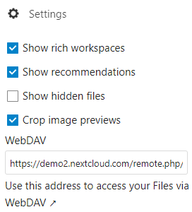
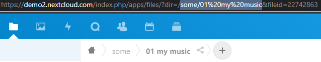
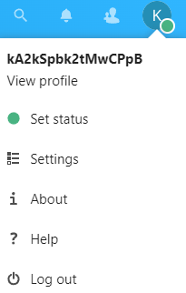
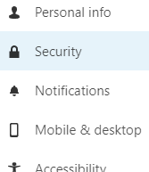
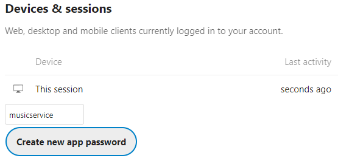
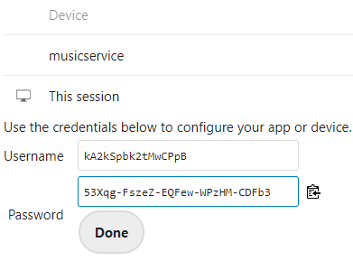

# Music sync Service

badges. which could be handy/informational?

place pictures and gifs where needed in the manual...

> "Don't worry about your music synchronisation anymore."

logo... how to make logo

youtube icon, sync icon, nextcloud icon

-----------------
ONE LINER that describes the Music Service the best...

A tool that synchronizes your YouTube playlists and other music providers with your Cloud Storage like Nextcloud as MP3s.

Downloads your YouTube music to your Nextcloud!

This application will monitor your playlists, and when you added a new song, it will detect it, download it and upload it to your Nextcloud account!

It downloads your YouTube playlists as MP3 with the highest quality possible. It will then upload those files to your Nextcloud account.

------------------------

### What can it do? ✨
- 🎵 Downloads your music from YouTube, SoundCloud [and many more](http://ytdl-org.github.io/youtube-dl/supportedsites.html)
- 😁 Automatically monitors your playlists for newly added music
- &nbsp;☁ &nbsp;Uploads your music as MP3 to your Cloud Storage account. Supports all Cloud providers with WebDAV compatibility: Nextcloud, ownCloud, pCloud, STACK [and many more](https://community.cryptomator.org/t/webdav-urls-of-common-cloud-storage-services/75)
- 🔄 Automatically converts video files to the highest quality MP3 possible
- 🖼 Adds coverart to your MP3's automatically (picture needed yt and local next to each other)
- 🗃 It's aware of the songs that have already been downloaded. This saves a lot of time since they don't get redownloaded every time the application runs again.

picture side by side. youtube playlist, and the nextcloud directory with a sync logo in the middle, the music sync service logo.

## How to install
The Music Service is a microservice application to run as a [Docker container](https://www.docker.com/resources/what-container/). Because of using Docker, every installation runs the same, for everyone. This brings efficiency and improves reliability. [Docker image release](https://hub.docker.com/r/thijstakken/musicservice)

Before you start, requirement, there is only one requirement, you need Docker to run the program:

⚠ You must have the Docker [Desktop](https://www.docker.com/products/docker-desktop/) or [Engine](https://docs.docker.com/engine/install/) installed on your system

recommendation:
ment to run on a server 24/7, it monitors your playlists, takes care of the download process for you, keeps it in sync, automatically.


1. Copy this code to your favorite editor, Notepad, Word etc. Some changes have to be made before you can run it:
```
docker run -d \
 --name musicservice \
 --restart=no \
 -v config:/config \
 -v musiccache:/music \
 -e URL=https://demo2.nextcloud.com/remote.php/dav/files/kA2kSpbk2tMwCPpB/ \
 -e DIRECTORY=some/01%20my%20music/ \
 -e USERNAME=kA2kSpbk2tMwCPpB \
 -e PASSWORD=demo \
 -e INTERVAL=5 \
thijstakken/musicservice:latest
```
2. Configure URL (required): <br/>
    1. Go to your Nextcloud website
    2. Go to the "files" menu at the top
    3. Now in the lower left corner, select "Settings"
    4. Copy the whole WebDAV URL you see there
    5. And place it after the "URL="



3. Configure DIRECTORY (required) (⚠ WORK IN PROGRESS): <br/>
You can leave it empty, then it will go to the root off your cloud storage.
or: <br/>

    1. Navigate to your music folder in Nextcloud 
    2. In the URL you have to copy the path, everything thats on the three dots: `/?dir=/.../&fileid=22742)`

end result: `some/01%20my%20music`

so you leave out the first "/" (maybe a bit confusing)

and you have to manually add an "/" at the end and then it's done. (not very nice)




4. Configure USERNAME (required): <br/>
    1. Go to your Nextcloud webpage and and click on your user-icon in the top right
    2. Click "View profile"
    3. Copy and paste your username in the USERNAME variable
    


5. Configure PASSWORD (required): <br/>

    Option 1 (account without 2FA multifactor)
    1. Copy your password into the PASSWORD variable

    Option 2 (account has 2FA multifactor protection)
    1. Go to the right top corner of your Nextcloud website and click the user-icon 
    
    

    2. Click on `Settings`
    3. In the left bar, go to "Security" 
    
    
    
    4. Scroll down to the bottom where you will find `Devices & sessions`

    

    5. Fill in an app name like `musicservice`
    6. Click `Create new app password`
    7. Copy the code that appears (53Xqg-...) into the PASSWORD variable



9. Configure Interval (optional): <br/>
The INTERVAL variable is optional, by default it's set to 5 if you dont specify anthting. if you want to run the script more often or less often, you can just punt in a number. It's in minutes, so a `10` will represent 10 minutes. The program will then run with intervals of 10 minutes. If you only want to run the script one time. You can set the number to 0 and then the script will not run on shedule and just stop after one run.

8. Open a terminal and run your command!

3. That's all! After the container stops, you should now see that you have one MP3 in your Nextcloud account in a folder called "music" at the root of your account.


7. After it did it's run it either did a good job or there was an error for some reason. To check a crashed container or just have a peek at the logs, you can run this command on your terminal `docker logs musicservice` and it will display the logs for you.

## Managing your playlist list

1. You can update which playlists to download here: /database/playlists.txt. The recommended way is to update that file when the container is turned off. Go to your Docker volumes location and find the file there.
Note: you can update the playlists while the container is running. If you made any changes, they will be in effect the next time it checks for newly added music. Default `INTERVAL` is 5 minutes.

with `docker volume inspect musicdatabase` (volumename)  you can find your volume location.

When you find the file, edit it with your favorite editor like Nano, and add every playlist/song that you want as a new line.
```
youtube.com/playlist1
youtube.com/playlist2
etc...
```

## How to best migrate from existing youtube-dl solution
If you where already using youtube-dl with the archive function, you probably have an downloaded.txt or similer file with all the songs you have already downloaded. 

To migrate, just copy the contents of that file over to the `/database/downloaded` file. You can find that file at the musicdatabase volume

run `docker volume inspect musicdatabase` to find the location of that volume on your disk


## Join the team 👪
Feel free to contribute, you can [submit issues here](https://github.com/thijstakken/MusicService/issues) and [fix issues/bugs, improve the application!](#developer-instructions-)

### Developer instructions 👩🏻‍💻👨🏻‍💻
System requirements: Have [Docker (Desktop or Engine)](https://www.docker.com/) installed on your system <br/>
Techniques: [Python](https://www.python.org/), [Docker](https://www.docker.com/), [youtube-dl](https://youtube-dl.org/) and [WebDAV](http://www.webdav.org/)

1. 🤠 Git clone the project with `git clone https://github.com/thijstakken/MusicService.git`
2. 🐛 [Pick a issue from the list or create a new issue and use that one](https://github.com/thijstakken/MusicService/issues)
3. 🐍 Start editing the code (Python)
4. 🏗 To build your new image, open a command line in the project folder and run `docker build -t musicservice:dev .`
5. 🧪 For testing, there is a good tool to use. [Nextcloud has a website](https://try.nextcloud.com/) where it will create a Nextcloud test environment. Select the "Instant trial" and you get a fresh environment for 60 minutes to play around. This way we can safely experiment with new code and functions. Copy the username into USERNAME and the password is always: demo <br/>

You can use this base developer Docker command, and change it to your needs to get started:
```
docker run \
 --name musicservice \
 --restart=no \
 -v config:/config \ \
 -v musiccache:/music \
 -e URL=https://demo1.nextcloud.com/remote.php/dav/files/wpS97kPjnDJo6gGQ/ \
 -e DIRECTORY= \
 -e USERNAME=wpS97kPjnDJo6gGQ \
 -e PASSWORD=demo \
 -e INTERVAL=0 \
musicservice:dev
```

6. 🎉 Create a branch and make your changes. When committing changes please use [Gitmoji](https://gitmoji.dev/) and [close the corresponding issue with "fixed"](https://github.com/gitbucket/gitbucket/wiki/How-to-Close-Reference-issues-and-pull-request) and the number of the issue `git commit -m ":bug: fixed #21 Your commit message"`
7. ⬆ Create a [pull request](https://github.com/thijstakken/MusicService/pulls)
8. 🚀 Wait for it to be reviewed and merged!

(cleaning up, or starting over with testing)
delete container with: ...
delete volumes with: docker volume rm my-vol

Use at your own risk, never trust the code of a random dude on the internet without first checking it yourself :)
