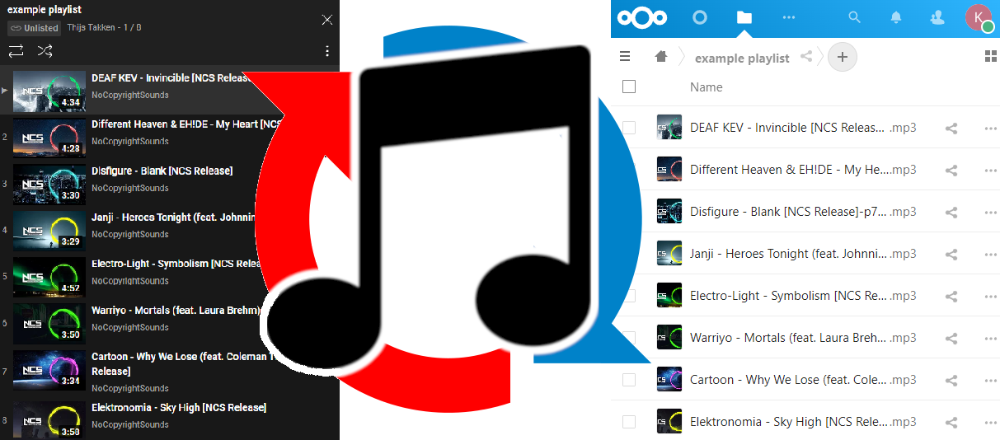

# Music sync Service (youtube-dl-sync)       

 

**A tool that synchronizes your YouTube playlists and other music providers with your Cloud Storage like Nextcloud as MP3s.**

### What does it do? ✨
- 🎵 Downloads your music from YouTube, SoundCloud [and many more](http://ytdl-org.github.io/youtube-dl/supportedsites.html)
- 😁 Automatically monitors your playlists for newly added music
- 🔄 Converts video files to the highest quality MP3 possible
- &nbsp;☁ &nbsp;Uploads your music as MP3 to your Cloud Storage account. Supports all Cloud providers with WebDAV compatibility: Nextcloud, ownCloud, pCloud, STACK [and many more](https://community.cryptomator.org/t/webdav-urls-of-common-cloud-storage-services/75)
- 🖼 Adds coverart to your MP3s automatically
- 🗃 It's aware of the songs that have already been downloaded. This saves a lot of time since they don't get redownloaded every time the application runs again.

 

 
 

## How to install
The Music Service is a microservice application and runs as a [Docker container](https://www.docker.com/resources/what-container/). Because of using Docker, every installation runs the same, for everyone. This brings programming efficiency and improves reliability. [Docker image release](https://hub.docker.com/r/thijstakken/musicservice)

> :warning: **You must have Docker installed**: Either the Docker [Desktop](https://www.docker.com/products/docker-desktop/) (with GUI) or [Engine](https://docs.docker.com/engine/install/) (no GUI) installed on your system.

 

1. How to run the musicservice:
    - Docker Compose (recommended): Copy the [docker-compose](docker-compose.yml) file contents to your editor and follow the steps
    - Run `docker compose up -d` in your terminal to start the stack

 

## Join the team 👪
Feel free to contribute, you can [submit issues here](https://github.com/thijstakken/MusicService/issues) and [fix issues/bugs, improve the application!](https://github.com/thijstakken/MusicService/wiki/Development-technical)

 

> :information_source: **Recommendation**: For the best experience, install this container on a computer/server which runs 24/7, so you will always have your music in sync.

> [!TIP]
> Please consider supporting your favorite artists through buying their music on https://bandcamp.com/ or https://www.beatport.com/

> [!TIP]
> Use at your own risk, never trust the code of a random dude on the internet without first checking it yourself :)
